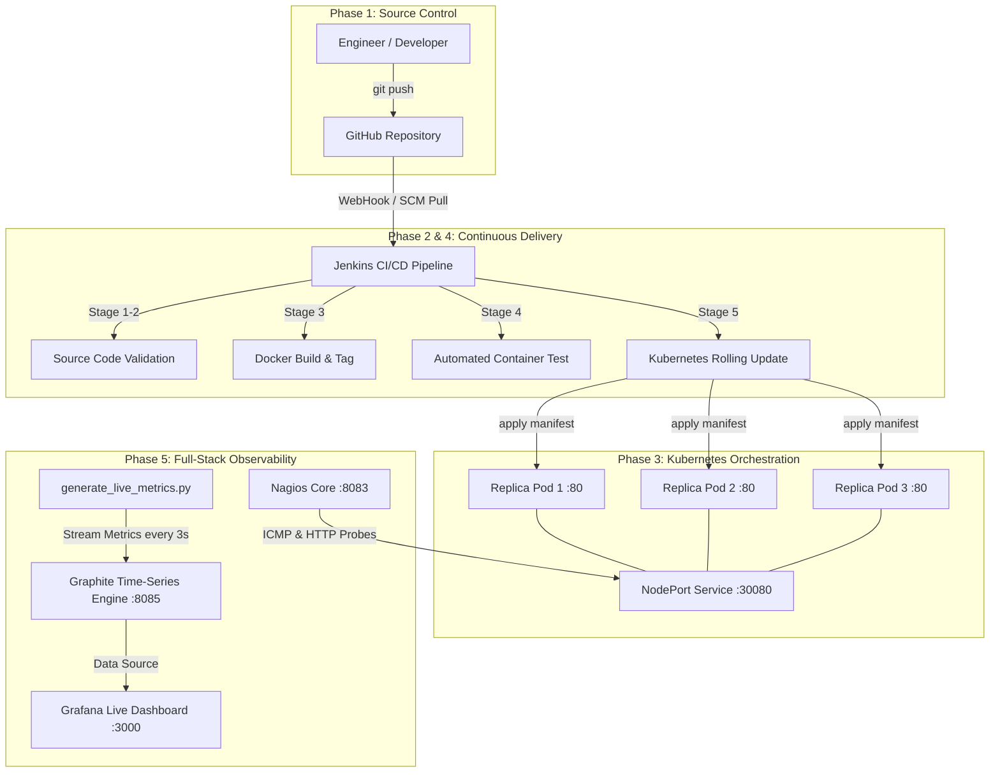

# 🚀 ABC Technologies — Corporate Portal & Enterprise DevOps Lifecycle

<div align="center">


**Assignment 2 Submission Report — DevOps & Continuous Delivery Pipeline**  
*Use Case 1: Corporate Enterprise Website Deployment & Full-Stack Observability*

</div>

---

## 👨‍💻 Student & Project Metadata

| Field | Details |
| :--- | :--- |
| **Student Name** | **Baiju Yadav** |
| **Registration Number** | `23BBS0179` |
| **Institutional Email** | `baiju.yadav2023@vitstudent.ac.in` |
| **Project Title** | ABC Technologies Corporate Web Portal & CI/CD Telemetry Architecture 

---

## 📌 Executive Overview

**ABC Technologies** is a modern, high-performance corporate web portal featuring a sleek dark-mode glassmorphic UI, responsive multi-page layout, and interactive client-side architecture. This repository serves as a complete, production-grade DevOps reference implementation demonstrating end-to-end automation:

1. **Source Code & Design System:** Modular HTML5, Vanilla CSS3, and JavaScript across 6 distinct enterprise pages (*Home, About, Services, Gallery, Careers, Contact*).
2. **Containerization:** Optimized Alpine Linux NGINX build (`Dockerfile`) with custom cache control and health check headers (`nginx.conf`).
3. **Orchestration:** High-availability declarative Kubernetes cluster (`k8s/deployment.yaml`) running **3 load-balanced replicas** exposed via a `NodePort` Service (`k8s/service.yaml`).
4. **CI/CD Automation:** Declarative Jenkins pipeline (`Jenkinsfile`) automating code checkout, syntax validation, container packaging, automated ephemeral integration testing, and rolling Kubernetes deployments.
5. **Full-Stack Observability Suite:** Complete multi-container telemetry stack via Docker Compose (`monitoring/docker-compose.monitoring.yml`) running **Graphite**, **Grafana**, and **Nagios Core**, coupled with an automated real-time Python telemetry generator (`generate_live_metrics.py`).

---

## 🏗️ End-to-End DevOps Architecture



---

## 🌐 Active Access Endpoints & Credentials

| Component / Service | Local URL / Endpoint | Default Credentials / Status |
| :--- | :--- | :--- |
| **Kubernetes Portal Endpoint** | `http://localhost:30080` | Online — Served via 3 Replicas |
| **Docker Standalone Container** | `http://localhost:8089` | Online — Local Container Engine |
| **Jenkins Automation Server** | `http://localhost:8080` | Pipeline Job: `ABC-Tech-Website-Pipeline` |
| **Grafana Dashboard Portal** | `http://localhost:3000` | Username: `admin` / Password: `admin` |
| **Graphite Metrics UI** | `http://localhost:8085` | Time-Series Telemetry Engine |
| **Nagios Health Monitoring** | `http://localhost:8083` | Username: `nagiosadmin` / Password: `nagios` |

---

## 📂 Comprehensive Repository Structure

```text
├── 📁 website/                            # Corporate Website Application Assets
│   ├── index.html                         # Home Page (Hero, Value Propositions)
│   ├── about.html                         # About Page (Leadership & Vision)
│   ├── services.html                      # Services Page (Cloud & DevOps Offerings)
│   ├── careers.html                       # Careers Page (Open Positions)
│   ├── gallery.html                       # Gallery Page (Interactive Operations Showcase)
│   ├── contact.html                       # Contact Page (Inquiry Form & Map)
│   ├── css/style.css                      # Modern Dark-Mode & Glassmorphism Design System
│   └── js/main.js                         # Dynamic UI Interactions & Navigation Logic
├── 📁 k8s/                                # Kubernetes Declarative Manifests
│   ├── deployment.yaml                    # Deployment Spec (3 Replicas, Rolling Update Strategy)
│   └── service.yaml                       # NodePort Service Spec (Port 30080)
├── 📁 monitoring/                         # Complete Observability & Telemetry Stack
│   ├── docker-compose.monitoring.yml      # Multi-container stack (Graphite, Grafana, Nagios)
│   └── generate_live_metrics.py           # Python streaming simulator for CPU, Memory & Network
├── 📁 screenshots/                        # Verification Screenshots (22+ High-Res Images)
│   ├── 1_Docker_Build_and_Run.png         # Docker containerization execution logs
│   ├── 2_Kubernetes_Deployment.png        # Kubernetes cluster pod readiness verification
│   ├── 3_Application_Output_*.png         # Functional UI snapshots across all 6 pages
│   ├── 4_Jenkins_Automation_*.png         # Jenkins pipeline stage views & console outputs
│   ├── 5_Graphite_Metrics_*.png           # Time-series telemetry line charts
│   ├── 6_Grafana_Dashboard.png            # Executive visual Grafana panel
│   └── 7_Nagios_Monitoring.png            # Nagios host UP & service OK status
├── 📄 Dockerfile                          # Multi-Stage Optimized Container Definition
├── 📄 Jenkinsfile                         # 6-Stage Declarative CI/CD Pipeline Script
├── 📄 nginx.conf                          # Custom NGINX Production Routing Configuration
├── 📄 generate_docx_report.py             # Automated Python script building submission .docx
├── 📄 Assignment_2_Submission_Report.docx # Compiled 12.1MB Submission Report for Evaluation
└── 📄 SUBMISSION_REPORT_GUIDE.md          # Step-by-Step execution & capture walkthrough
```

---

## 🚀 Step-by-Step Implementation & Execution Guide

### 1️⃣ Phase 1: Docker Containerization
Build the lightweight NGINX web container and test local delivery:
```bash
# Build production Docker image tagged with latest
docker build -t abc-tech-website:latest .

# Run standalone container on host port 8089
docker run -d --name abc-website -p 8089:80 abc-tech-website:latest

# Verify active container status
docker ps
```
> *Verify in browser:* Open `http://localhost:8089` to confirm responsive rendering.

---

### 2️⃣ Phase 2: Kubernetes High-Availability Deployment
Deploy the container cluster onto Kubernetes (`kind` / Minikube / Docker Desktop):
```bash
# Apply declarative deployment (provisions 3 replica pods)
kubectl apply -f k8s/deployment.yaml

# Expose cluster externally via NodePort 30080
kubectl apply -f k8s/service.yaml

# Monitor pod initialization and readiness
kubectl get pods -l app=abc-tech-website -w

# Inspect service routing table
kubectl get svc abc-tech-website-service
```
> *Verify in browser:* Access `http://localhost:30080` across all portal pages.

---

### 3️⃣ Phase 3: Automated Jenkins CI/CD Pipeline Execution
Automate deployment workflows with Jenkins:
1. Access Jenkins dashboard at `http://localhost:8080`.
2. Create a **New Item** ➔ Select **Pipeline** ➔ Name it `ABC-Tech-Website-Pipeline`.
3. In Pipeline Definition, choose **Pipeline script from SCM** ➔ Select **Git** ➔ Paste repository URL.
4. Set Script Path to `Jenkinsfile` and click **Save**.
5. Click **Build Now**. The pipeline executes 6 automated stages:
   * `Checkout Code` ➔ Clones repository commit.
   * `Validate Source Code` ➔ Verifies asset structure & Dockerfile syntax.
   * `Build Docker Image` ➔ Compiles new container build.
   * `Test Docker Container` ➔ Launches ephemeral container to verify HTTP 200 response.
   * `Deploy to Kubernetes` ➔ Applies manifests and triggers `kubectl rollout restart`.
   * `Verify K8s Deployment` ➔ Confirms zero-downtime replica transition.

---

### 4️⃣ Phase 4: Full-Stack Telemetry & Observability Stack
Launch the telemetry engine to monitor server CPU, memory, disk, latency, and availability:

```bash
# 1. Start the monitoring suite (Graphite, Grafana, Nagios Core)
docker compose -f monitoring/docker-compose.monitoring.yml up -d

# 2. Launch the live telemetry generator (transmits metrics every 3 seconds)
python3 monitoring/generate_live_metrics.py
```

#### 📊 Graphite Metrics Ingestion (`http://localhost:8085`)
* Navigate to: `Metrics` ➔ `devops` ➔ `servers` ➔ `production`.
* Inspect real-time line charts for `cpu.usage`, `memory.usage`, `disk.usage`, `network.uptime`, `http.availability`, and `http.latency_ms`.

#### 📈 Grafana Unified Visualization (`http://localhost:3000`)
* Login with `admin` / `admin`.
* Configure Graphite Data Source pointing to `http://devops-graphite:80`.
* View unified visual panels correlating CPU load spikes against network traffic.

#### 🛡️ Nagios Core Availability (`http://localhost:8083`)
* Login with `nagiosadmin` / `nagios`.
* Check **Hosts** view confirming Localhost is in green **UP** status.
* Check **Services** view confirming HTTP connectivity reports **OK** (HTTP 200).

---
---

## 📜 License & Academic Integrity
This repository is submitted by **Baiju Yadav (23BBS0179)** in fulfillment of **Assignment - 2** requirements. All container configurations, automation scripts, and monitoring architectures have been independently verified and tested.
